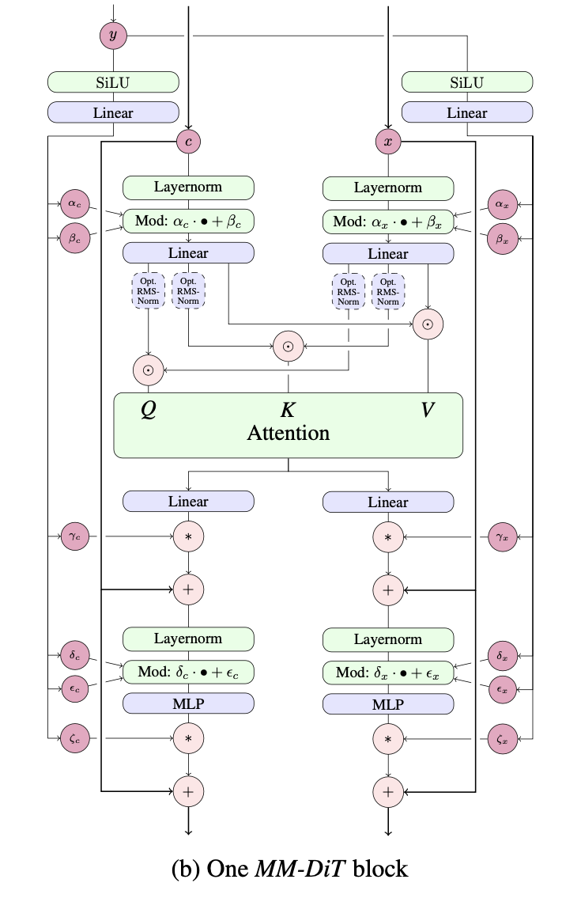

</img>

## MMDiT

Implementation of a single layer of the MMDiT, proposed by Esser et al. in <a href="https://arxiv.org/abs/2403.03206">Stable Diffusion 3</a>, in Pytorch

Besides a straight reproduction, will also generalize to > 2 modalities, as I can envision an MMDiT for images, audio, and text.

Will also offer an <a href="https://github.com/lucidrains/mmdit/blob/main/mmdit/adaptive_attention.py">improvised variant of self attention</a> that adaptively selects the weights to use through learned gating. This idea came from adaptive convolutions applied by Kang et al. for GigaGAN.

## Install

```bash
$ pip install mmdit
```

## Usage

```python
import torch
from mmdit import MMDiTBlock

# define mm dit block

block = MMDiTBlock(
    dim_joint_attn = 512,
    dim_cond = 256,
    dim_text = 768,
    dim_image = 512,
    qk_rmsnorm = True
)

# mock inputs

time_cond = torch.randn(2, 256)

text_tokens = torch.randn(2, 512, 768)
text_mask = torch.ones((2, 512)).bool()

image_tokens = torch.randn(2, 1024, 512)

# single block forward

text_tokens_next, image_tokens_next = block(
    time_cond = time_cond,
    text_tokens = text_tokens,
    text_mask = text_mask,
    image_tokens = image_tokens
)
```

A generalized version can be used as so

```python
import torch
from mmdit.mmdit_generalized_pytorch import MMDiT

mmdit = MMDiT(
    depth = 2, 
    dim_modalities = (768, 512, 384),
    dim_joint_attn = 512,
    dim_cond = 256,
    qk_rmsnorm = True
)

# mock inputs

time_cond = torch.randn(2, 256)

text_tokens = torch.randn(2, 512, 768)
text_mask = torch.ones((2, 512)).bool()

video_tokens = torch.randn(2, 1024, 512)

audio_tokens = torch.randn(2, 256, 384)

# forward

text_tokens, video_tokens, audio_tokens = mmdit(
    modality_tokens = (text_tokens, video_tokens, audio_tokens),
    modality_masks = (text_mask, None, None),
    time_cond = time_cond,
)
```

## Citations

```bibtex
@article{Esser2024ScalingRF,
    title   = {Scaling Rectified Flow Transformers for High-Resolution Image Synthesis},
    author  = {Patrick Esser and Sumith Kulal and A. Blattmann and Rahim Entezari and Jonas Muller and Harry Saini and Yam Levi and Dominik Lorenz and Axel Sauer and Frederic Boesel and Dustin Podell and Tim Dockhorn and Zion English and Kyle Lacey and Alex Goodwin and Yannik Marek and Robin Rombach},
    journal = {ArXiv},
    year    = {2024},
    volume  = {abs/2403.03206},
    url     = {https://api.semanticscholar.org/CorpusID:268247980}
}
```

```bibtex
@inproceedings{Darcet2023VisionTN,
    title   = {Vision Transformers Need Registers},
    author  = {Timoth'ee Darcet and Maxime Oquab and Julien Mairal and Piotr Bojanowski},
    year    = {2023},
    url     = {https://api.semanticscholar.org/CorpusID:263134283}
}
```

```bibtex
@article{Zhu2024HyperConnections,
    title   = {Hyper-Connections},
    author  = {Defa Zhu and Hongzhi Huang and Zihao Huang and Yutao Zeng and Yunyao Mao and Banggu Wu and Qiyang Min and Xun Zhou},
    journal = {ArXiv},
    year    = {2024},
    volume  = {abs/2409.19606},
    url     = {https://api.semanticscholar.org/CorpusID:272987528}
}
```
